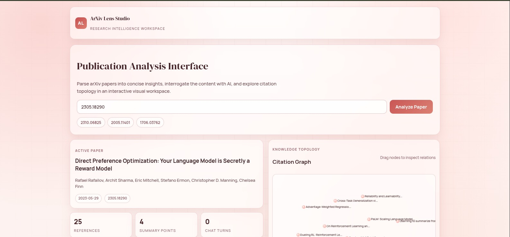

# Research Tool

Research Tool is a full-stack application for analyzing arXiv papers. It fetches paper content, generates summaries, builds citation graphs, indexes paper text for retrieval, and supports chat-style Q&A grounded in retrieved context.

## What It Does

- Analyze a paper by arXiv ID using `POST /analyze`
- Summarize content using a Groq-hosted model (with local fallback behavior if API key is missing)
- Build a citation graph from Semantic Scholar data
- Build and store embeddings in ChromaDB for retrieval
- Answer questions using retrieved chunks via `POST /chat`
- Provide a health endpoint at `GET /health`

## Tech Stack

- Backend: FastAPI, Uvicorn, LangChain, ChromaDB, Sentence Transformers, Groq SDK
- Frontend: React + Vite, react-force-graph-2d
- Data sources: arXiv, Semantic Scholar

## Project Structure

- `backend/`: API server and analysis services
- `frontend/`: React UI
- `storage/`: persisted PDFs and Chroma collections

## How Grok/Groq Works Here

The backend currently uses the Groq SDK (package: `groq`) in:

- `backend/services/summarizer.py`
- `backend/services/rag_engine.py`

Configuration behavior:

- API key lookup order: `GROQ_API_KEY`, then `GROK_API_KEY`
- Model env var: `GROQ_MODEL` (default: `llama-3.3-70b-versatile`)

If no key is provided, the app does not crash:

- Summarizer falls back to sentence-based local summarization
- Q&A falls back to returning retrieved context blocks

## Environment Variables

Create a root `.env` file (project root):

```env
# Required for hosted generation
GROQ_API_KEY=your_groq_api_key_here
# Optional alias if you prefer this name
# GROK_API_KEY=your_groq_api_key_here

# Optional model override
GROQ_MODEL=llama-3.3-70b-versatile

# Optional storage paths
PDF_STORAGE_PATH=../../storage/pdfs
CHROMA_DB_PATH=../../storage/chroma_db
```

Notes:

- In local development, backend code defaults to relative paths if these are not set.
- Frontend API base URL is currently hardcoded to `http://localhost:8000` in `frontend/src/App.jsx`.

## Run Locally

### 1) Backend

```bash
cd backend
python -m venv .venv
source .venv/bin/activate
pip install -r requirements.txt
uvicorn main:app --reload --host 0.0.0.0 --port 8000
```

### 2) Frontend

```bash
cd frontend
npm install
npm run dev
```

Open the UI at `http://localhost:5173`.

## API

### Analyze paper

```bash
curl -X POST http://localhost:8000/analyze \
  -H "Content-Type: application/json" \
  -d '{"arxiv_id":"2310.06825"}'
```

### Ask question

```bash
curl -X POST http://localhost:8000/chat \
  -H "Content-Type: application/json" \
  -d '{"arxiv_id":"2310.06825","question":"What is the main contribution?"}'
```

### Health check

```bash
curl http://localhost:8000/health
```

## UI Screenshot




## Docker

Build and run each app from its folder:

- Backend Dockerfile: `backend/Dockerfile` (serves FastAPI on port 8000)
- Frontend Dockerfile: `frontend/Dockerfile` (serves static build via nginx on port 80)
